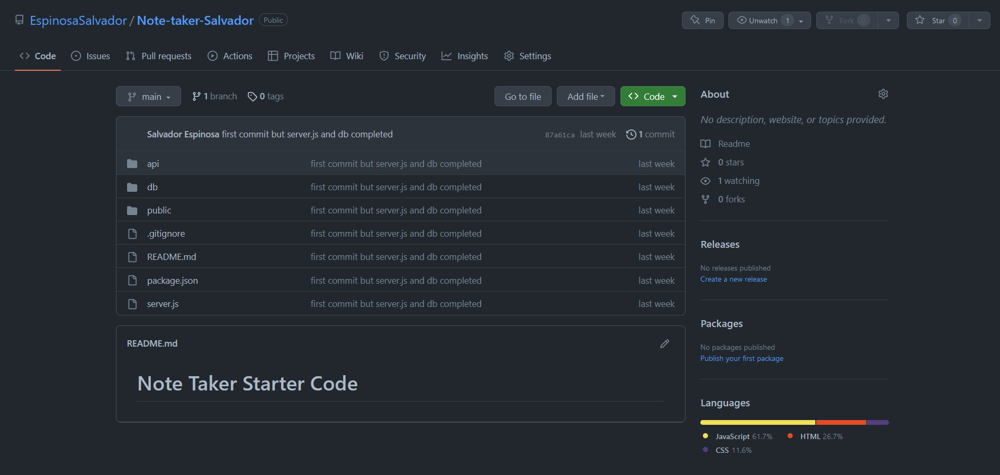
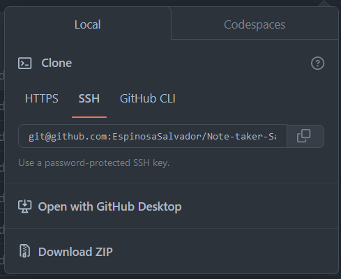
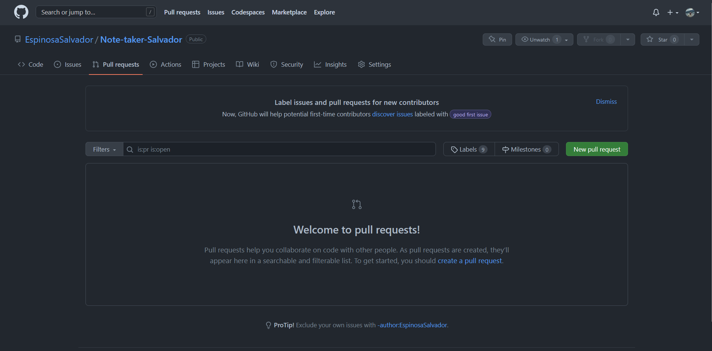
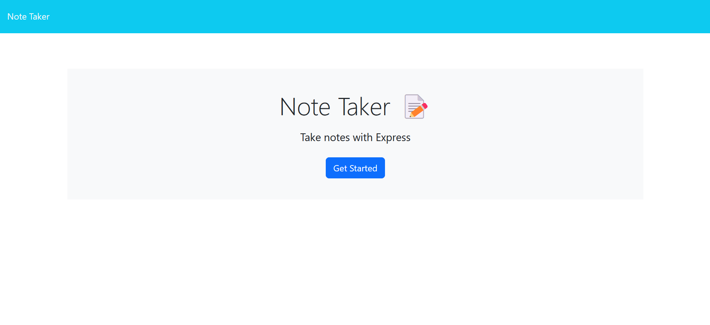
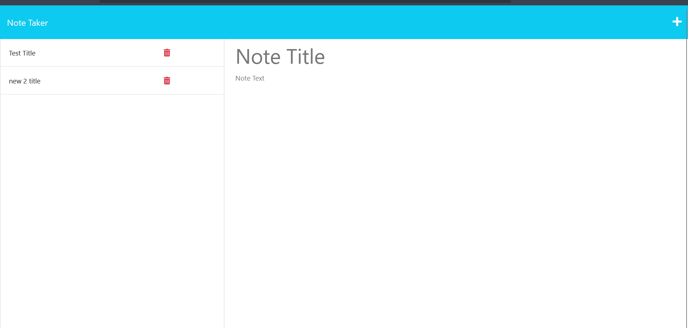
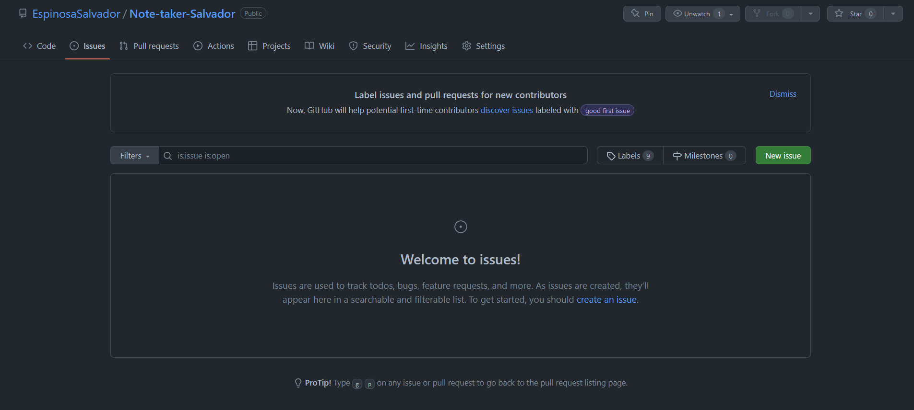

# Note-taker-Salvador

## Table of Content

* [Introduction](#introduction)
* [Features](#features)
* [Requirements](#requirements)
* [Installation](#installation)
* [Configuration](#configuration)
* [What you should be able to see](#what-you-should-be-able-to-see)
* [Troubleshooting](#troubleshooting)
* [Next Phase Development](#next-phase-development)
* [FAQ (Frecuently Asked Questions)](#faq-frecuentrly-asked-questions)
* [Team](#team)

## Introduction

Welcome to the Note-taker application. this application allows users to write, save, and delete notes.

[here is the link to my webpage in heroku running](https://floating-fortress-79975.herokuapp.com/)

## Features

* Create new notes with a title and text
* Save notes to a database
* Delete existing notes
* Edit notes

## Requirements

the requirements to run this webpage are the following.

* Vs code or any code editor
* GitHub
* Internet
* Download JS to its latest release.
* Node.js
* express
* fs

I recommend to download *nodemon* to have a better user expirience. but as long as you have the ones above you are in the clear.

## Installation

To install this project please proceed to my [GitHub Repository](https://github.com/EspinosaSalvador/Note-taker-Salvador)

you should be able to see this,



Click on code as shown in the image



Copy the SSH key or the HTTPS key and open.

* Terminal
* Git bash
* CMD

either one of this will work. please proceed to the terminal an put in your Terminal,

```
git clone git@github.com:EspinosaSalvador/Note-taker-Salvador.git
```

and now you have a copy of the code.

you can work/play/use the app

## Configuration

If you want to do any configurations on this project please open a new branch you can do this by putting the following code in your terminal,

```
git checkout -b ＜new-branch＞
```

switch branches putting the following code on your terminal.

```
git checkout ＜branchname＞
```

If you want to show us your code and merge please open a pull request on

[Github](https://github.com/EspinosaSalvador/Note-taker-Salvador/pulls).



## What you should be able to see

[here is the link to my webpage in heroku running](https://floating-fortress-79975.herokuapp.com)

These is what you should be able to see in the Webpage, in Heroku


the webpage is very straight forward we only need to click on get started to start taking notes



you need to write the title and the text after that you can click on the following image


and if you want to delete items you just need to click on the trash bin


## Troubleshooting

The team-profile-generator is in version 1.0 ,please let me know if there are anybug in the webpage by issuing it in [Github](https://github.com/EspinosaSalvador/Note-taker-Salvador/issues)



## Next Phase Development

This are will be updated depending on the feedback from the users.

## FAQ (Frecuentrly Asked Questions)

We will update this part when we have some frequently asked question.

## Team

* Salvador Espinosa Valdez
